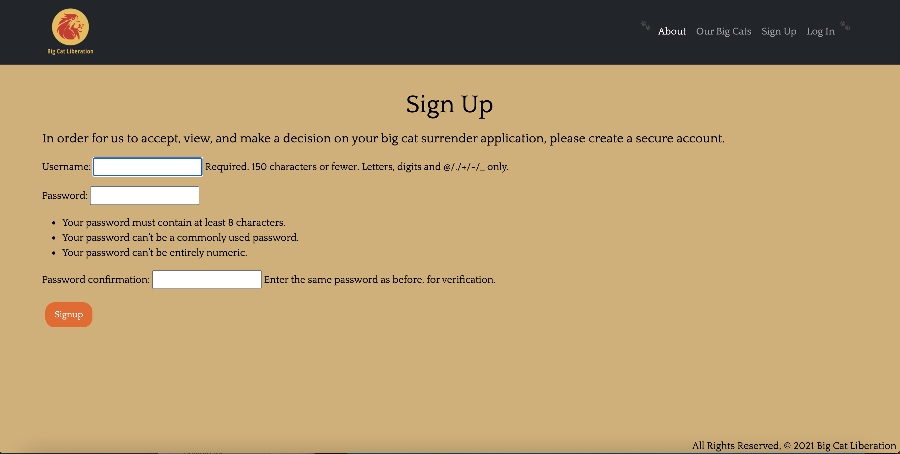
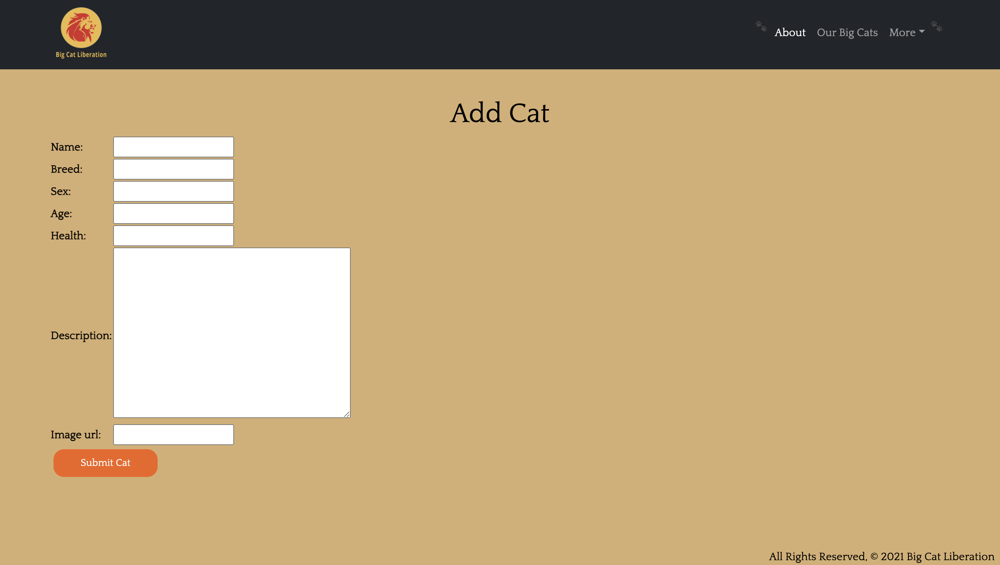
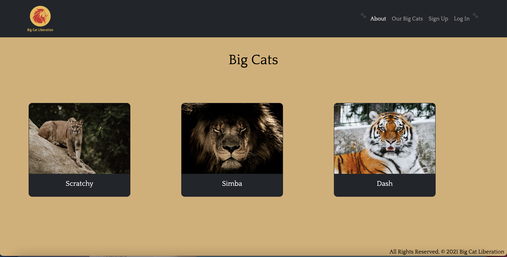
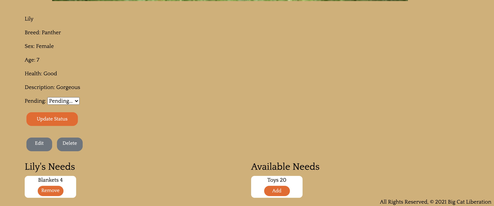

## Big Cat Liberation
### Description: 

The Big Cat Sanctuary is located in the heart of the Kent countryside in Smarden, Kent and is set in 32 acres of grass land. It is home to variety of different cats species from the smallest in the world to the most endangered and everything in between.

Designed a sanctuary app for big cats. Where the user gives away their cats if they aren't able to take care of them anymore. Non-authorized users can see all the cats in the sanctuary however they aren't able to fill up the form to give away their cats unless they create an account. Once the authorized user creates an account they will be able to fill up the form to give away their cats. And once their form is approved by the admin they will be able to see all the cats in the sanctuary. After that, the admin checks what the cats need and according to that, they make changes to the database. The admin is also able to remove or edit the details of the cats on the database.

### Screenshots of the app: 

 

 

 

 

### Technologies Used: 

* Django
* SQL
* PostgreSQL
* HTML
* CSS
* Bootstrap

### Getting Started: 
* Link to the [Trello Board](https://trello.com/b/SFAIHgpR/planning)
* Link to the [Pitch Deck](https://docs.google.com/presentation/d/1Lxul0tmPEzeC0ydBnFt54hAZ-nQEo6-a13E3LvrZzTk/edit#slide=id.ge827bfc624_3_0)
* Link to the [Heroku](https://the-big-cat-liberation.herokuapp.com)

